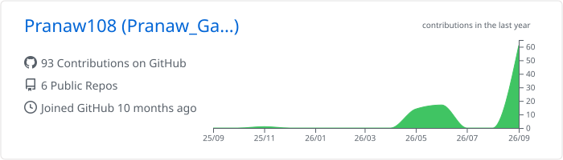
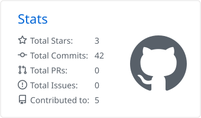
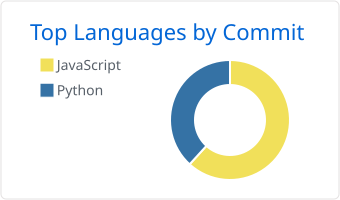

**Flutter & FastAPI developer · Data Scientist** 
Turning raw data into models, APIs and apps people actually use.

## About me

I build cross-platform mobile apps with **Flutter** and the **FastAPI** backends behind them, and I bring a data scientist's toolkit to both: ETL pipelines, exploratory analysis, recommendation and ML models, and dashboards that put the results in front of decision-makers.

- 🔭 **Currently building:** Flutter apps with on-device recommendations, and end-to-end analytics projects like the [Space Mission Analytics Dashboard](https://github.com/Pranaw108/Space_Launch_Analysis)
- 🌱 **Learning:** machine learning, predictive analytics and data engineering
- 🤝 **Open to:** full-time roles, freelance work and project collaborations
- 📫 **Reach me:** [pranawgautam@gmail.com](mailto:pranawgautam@gmail.com)

## Tech stack

| | |
| :-- | :-- |
| **Languages** |  |
| **Mobile & backend** |  |
| **Data science & ML** |       |
| **BI & design** |   |
| **Web** |  |
| **Databases** |  |
| **Cloud & tools** |  |

## Featured projects

| Project | What it does | Built with |
| :-- | :-- | :-- |
| 🚀 **[Space Mission Analytics Dashboard](https://github.com/Pranaw108/Space_Launch_Analysis)** | End-to-end analysis of 8,000+ global space missions across decades: MySQL queries, Python analysis and an interactive Power BI dashboard | Python · SQL · MySQL · Power BI |
| 🧑‍💻 **[Portfolio](https://github.com/Pranaw108/my-portfolio)** · [live](https://my-portfolio-two-gilt-97.vercel.app/) | Personal portfolio with animated sections and routing | React · Vite · Tailwind CSS · Framer Motion |
| 🧩 **[Mini Projects](https://github.com/Pranaw108/mini-projects)** · [live](https://todo-app-72ci.vercel.app) | A collection of small front-end apps, starting with a to-do app | React · Vite |

## GitHub activity

<picture>
  <source media="(prefers-color-scheme: dark)" srcset="./profile-summary-card-output/github_dark/0-profile-details.svg" />
  
</picture>

<picture>
  <source media="(prefers-color-scheme: dark)" srcset="./profile-summary-card-output/github_dark/3-stats.svg" />
  
</picture>
<picture>
  <source media="(prefers-color-scheme: dark)" srcset="./profile-summary-card-output/github_dark/2-most-commit-language.svg" />
  
</picture>

<picture>
  <source media="(prefers-color-scheme: dark)" srcset="https://streak-stats.demolab.com/?user=Pranaw108&theme=dark&background=0D1117&hide_border=true" />
  
</picture>

<picture>
  <source media="(prefers-color-scheme: dark)" srcset="https://raw.githubusercontent.com/Pranaw108/Pranaw108/output/github-snake-dark.svg" />
  
</picture>

Cards regenerate daily via GitHub Actions.

